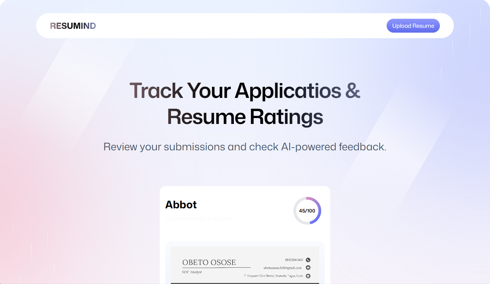

# RESUMIND

**Smart feedback for your dream job** - An AI-powered resume analysis platform that provides detailed ATS scoring and improvement suggestions.



## 🚀 Features

- **AI-Powered Resume Analysis**: Get detailed feedback on your resume using advanced AI models
- **ATS Score Calculation**: Understand how well your resume passes through Applicant Tracking Systems
- **Multi-Category Scoring**: Analysis across tone & style, content, structure, and skills
- **PDF Upload & Processing**: Upload PDF resumes with automatic image conversion for preview
- **Job-Specific Feedback**: Tailored suggestions based on company and job description
- **Resume Portfolio**: Track multiple resume submissions and their performance
- **Interactive Dashboard**: Visual score representations with detailed breakdowns

## 🏗️ Tech Stack

- **Frontend**: React 19 with TypeScript
- **Routing**: React Router v7
- **Styling**: Tailwind CSS with custom design system
- **File Processing**: PDF.js for PDF to image conversion
- **Cloud Storage**: Puter.js for file storage and user authentication
- **AI Integration**: Claude AI for resume analysis
- **State Management**: Zustand
- **Build Tool**: Vite

## 📁 Project Structure

```
app/
├── components/           # Reusable UI components
│   ├── ATS.tsx          # ATS score display component
│   ├── Accordion.tsx    # Collapsible content component
│   ├── Details.tsx      # Detailed feedback breakdown
│   ├── FileUploader.tsx # Drag & drop file upload
│   ├── Navbar.tsx       # Navigation component
│   ├── ResumeCard.tsx   # Resume preview cards
│   ├── ScoreCircle.tsx  # Circular score visualization
│   ├── ScoreGuage.tsx   # Gauge score visualization
│   └── Summary.tsx      # Score summary component
├── lib/                 # Utilities and configurations
│   ├── pdf2img.ts       # PDF to image conversion
│   ├── puter.ts         # Puter.js integration & store
│   └── utils.ts         # Common utilities
├── routes/              # Page components
│   ├── auth.tsx         # Authentication page
│   ├── home.tsx         # Dashboard/homepage
│   ├── resume.tsx       # Individual resume review
│   ├── upload.tsx       # Resume upload & analysis
│   └── wipe.tsx         # Development utility
├── app.css              # Global styles and design tokens
└── root.tsx             # App root and layout
```

## 🎨 Design System

The application uses a custom design system with:

- **Typography**: Mona Sans font family
- **Color Palette**: Custom gradient themes with semantic color tokens
- **Components**: Consistent spacing, shadows, and border radius
- **Responsive Design**: Mobile-first approach with Tailwind breakpoints

### Key Design Tokens

```css
--color-badge-green: #d5faf1    /* Success states */
--color-badge-red: #f9e3e2      /* Error states */  
--color-badge-yellow: #fceed8   /* Warning states */
```

## 🚦 Getting Started

### Prerequisites

- Node.js 18+ 
- npm or yarn
- A Puter.js account for cloud storage

### Installation

1. Clone the repository:
```bash
git clone https://github.com/your-username/resumind.git
cd resumind
```

2. Install dependencies:
```bash
npm install
```

3. Set up Puter.js:
   - Create an account at [Puter.com](https://puter.com)
   - The app will automatically initialize Puter.js on startup

4. Start the development server:
```bash
npm run dev
```

5. Open [http://localhost:5173](http://localhost:5173) in your browser

## 📱 Usage

### 1. Authentication
- Sign in using Puter.js authentication
- Your data is stored securely in your Puter cloud storage

### 2. Upload Resume
- Navigate to the upload page
- Fill in company name, job title, and job description (optional)
- Drag and drop or click to upload your PDF resume
- Click "Analyze Resume" to start the AI analysis

### 3. Review Feedback
- View your overall resume score (0-100)
- Explore detailed feedback across four categories:
  - **Tone & Style**: Professional language and formatting
  - **Content**: Relevance and quality of information
  - **Structure**: Organization and layout
  - **Skills**: Technical and soft skills alignment
- Get specific ATS compatibility insights

### 4. Track Progress
- View all your submitted resumes on the dashboard
- Compare scores across different applications
- Access detailed reviews anytime

## 🧠 AI Analysis Features

### Scoring Categories

1. **ATS Score**: How well your resume passes through Applicant Tracking Systems
2. **Tone & Style**: Professional language, consistency, and readability
3. **Content**: Relevance, achievements, and impact statements
4. **Structure**: Layout, sections, and visual hierarchy
5. **Skills**: Technical skills alignment and soft skills presentation

### Feedback Types

- ✅ **Good**: Things your resume does well
- ⚠️ **Improve**: Areas needing enhancement with detailed explanations

## 🔧 Configuration

### Environment Setup

The application automatically initializes Puter.js. No additional environment variables are required for basic functionality.

### PDF Processing

PDF.js worker is served from the public directory:
```javascript
lib.GlobalWorkerOptions.workerSrc = "/pdf.worker.min.mjs";
```

## 🎯 AI Prompt Engineering

The AI analysis uses carefully crafted prompts that:
- Consider job-specific requirements
- Provide balanced, constructive feedback
- Score based on industry standards
- Include actionable improvement suggestions

## 📊 Data Storage

### Puter.js Integration

- **File Storage**: PDFs and generated images
- **Key-Value Store**: Resume metadata and feedback
- **User Authentication**: Secure, serverless auth

### Data Structure

```typescript
interface Resume {
  id: string;
  companyName?: string;
  jobTitle?: string;
  imagePath: string;
  resumePath: string;
  feedback: Feedback;
}
```

## 🔒 Security & Privacy

- User authentication through Puter.js
- Files stored securely in user's personal cloud storage
- No server-side data persistence
- Resume content processed securely through AI APIs

## 🚀 Deployment

### Build for Production

```bash
npm run build
```

### Deploy to Puter

```bash
npm run deploy
```

The application is designed to run entirely client-side with Puter.js handling backend services.

## 🤝 Contributing

1. Fork the repository
2. Create a feature branch: `git checkout -b feature/amazing-feature`
3. Commit your changes: `git commit -m 'Add amazing feature'`
4. Push to the branch: `git push origin feature/amazing-feature`
5. Open a Pull Request

### Development Guidelines

- Follow TypeScript best practices
- Use Tailwind CSS for styling
- Maintain component modularity
- Write meaningful commit messages

## 📝 License

This project is licensed under the MIT License - see the [LICENSE](LICENSE) file for details.

## 🙏 Acknowledgments

- [Puter.js](https://puter.com) for cloud storage and authentication
- [PDF.js](https://mozilla.github.io/pdf.js/) for PDF processing
- [Claude AI](https://anthropic.com) for intelligent resume analysis
- [Tailwind CSS](https://tailwindcss.com) for the design system

## 📞 Support

For support, email [support@resumind.com](mailto:bobzy005@gmail.com) or create an issue in this repository.

---

**Made with ❤️ for job seekers everywhere**